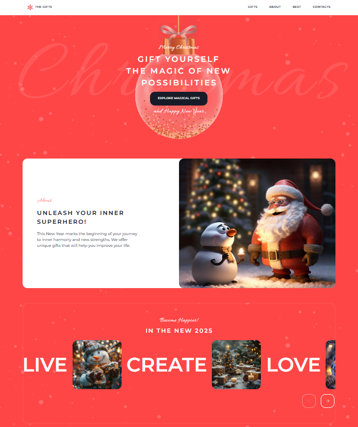
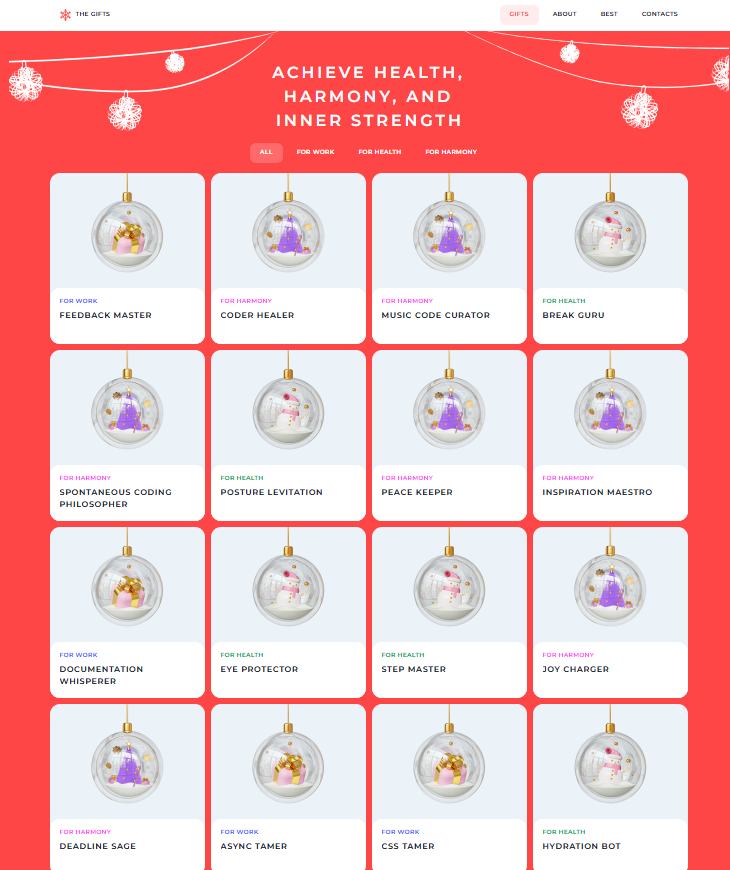

# 🎄 Christmas Shop

---

## 📌 Overview

**Christmas Shop** is a responsive two-page web application designed for browsing and selecting Christmas gifts.  
The project uses **vanilla JavaScript** to implement client-side interactivity and includes **Home** and **Gifts** pages, providing a smooth user experience across desktop, tablet, and mobile devices.

---

## ✨ Features

### 🧭 Navigation & Layout
- Responsive burger menu for screens **768px and below**
- Smooth anchor scrolling
- Scroll locking when menu or modal is open

### 🎠 Home Page
- Slider with left/right arrow navigation
- Countdown timer to New Year (UTC+0)
- Random display of **4 gift cards** on each page load
- Slider resets correctly on screen resize

### 🎁 Gifts Page
- Category-based filtering of gifts
- Active category state
- Scroll-to-top button (mobile only)
- Dynamic gift cards generated from data

### 🪟 Modal Window
- Opens when clicking on any gift card
- Shows detailed gift description and superpowers
- Darkened background overlay
- Page scroll disabled while modal is open
- Closes on overlay click or close button

---

## 🛠 Technology Stack
- **HTML5** (semantic markup)
- **CSS3** (responsive layout, animations)
- **JavaScript (ES6+)**
- No external libraries or frameworks
- Data-driven DOM generation from JSON

---

## 🧱 Project Structure

### Pages
- **Home**
    - Slider
    - Countdown timer
    - Best Gifts (randomized)
- **Gifts**
    - Category tabs
    - Gifts grid
    - Scroll-to-top button

### Shared Components
- Header with navigation
- Burger menu (mobile)
- Modal window
- Footer

---

## ⚙️ Key Implementation Details
- Burger menu created using **pure HTML and CSS** (no images or SVG)
- Slider behavior depends on screen width:
    - Desktop (>768px): full scroll in **3 clicks**
    - Mobile (≤768px): full scroll in **6 clicks**
- Category switching without page reload
- All gift cards and modals are generated dynamically from data objects

---

## 📚 Skills Demonstrated
- Responsive web layout
- Semantic HTML
- JavaScript DOM manipulation
- State-based UI logic
- Clean, maintainable code

---

## 🎨 Design

[Figma Layout](https://www.figma.com/design/zTB01BwWZVoXYK5atH3eZT/Christmas-Shop?node-id=0-1)

---

## ▶️ Running the Project

1. `git clone https://github.com/blk-thorn/christmas-shop.git`
2. Open index.html in your browser (no build tools or dependencies required).

## 📸 Preview

